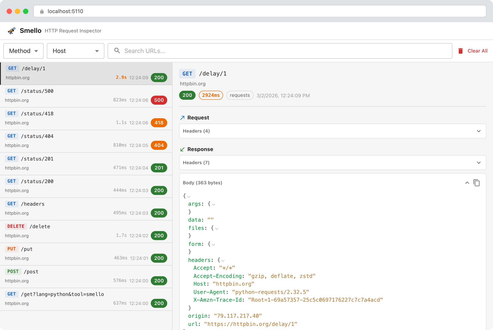

Title: Smello World? For HTTP Requests
Date: 2026-03-31 13:47
Modified: 2026-03-31 13:47
Tags: python, http, web, requests, httpx, rest, api
Category: Python
Slug: smello-world-with-http
Authors: Joe Stanley
Summary: A short article, but hopefully getting a jump on getting back in the habbit of documenting what I'm up to. Check out this cool tool!

OK... It's been a while.

Hi, my name is Joe.

I'm here today to tell you about a neat little tool that I came across in one of the email subscriptions I have
for Python. Yes... I'm one of *those* guys. I like to see all the cool new stuff happening in the Python sphere.

All I really have to say is check this out...

{width=100%}

Let me introduce you to [Smello](https://github.com/smelloscope/smello), an MIT-licensed tool to help you capture
HTTP requests from your Python app and log them for analysis. Go read up on their
[blog post](https://roman.pt/posts/smello/) for some more information, but let me say... this thing is neat! I'll'
definitely need to try it out sometime soon.
